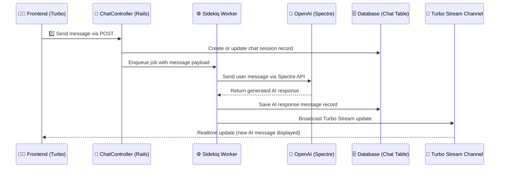

# Overview

Web chat interface to chatGPT

## Application
Visit http://0.0.0.0:3000/chats for the web chat interface to chatGPT

# System Design

## Chat Interface System Sequence Diagram




# Integration & External Services

The chat interface uses Ruby Spectre gem to interface with the OpenAI foundation model.

Add the OpenAI API key to the app root directory ~/.env file

or 

If there's no .env file in app root directory yet, add the OpenAI API key to .env.example 

```vim
OPENAI_API_KEY=your_openai_api_key
```

Then copy .env.example to .env

```bash
cp .env.example .env
```

# Future Work

- Add a external service object OpenAI fetcher for external API fetch (app/services/external/openai.rb)
- Add a message broadcaster object for handling Turbo stream broadcasts (app/broadcasters/message_broadcaster.rb)
- Add turbo partial for progress bar or loading... indicator
- Add SpectreOpenAIJob error handling
- Add Roadauth user authentication and user table, tie chats to user sessions
- Add chat session tab feature with new data table modeling (chat, questions, responses)
- Add Tailwind for nice UI layout
- Cleanup `rails generate scaffold chat` files
- Add sidekiq worker, chat controller, service object, and broadcaster object tests
- Add capybara end to end system test
- Update system sequence diagrams (include all turbo-stream calls, call parameters, service & broadcaster objects)
- Add persistence table design for users, questions and answers session
