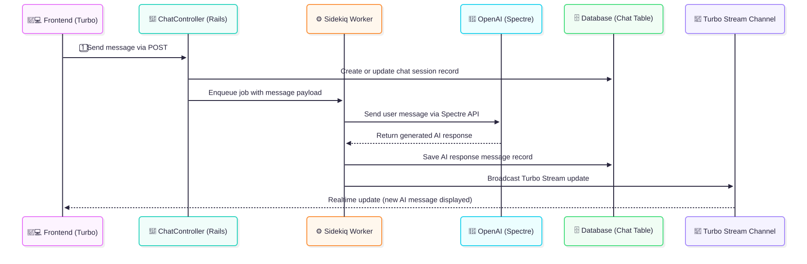
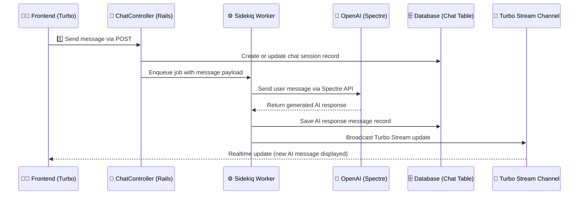

# Overview

Web chat interface to chatGPT

# System Design

## Chat Interface System Sequence Diagram

## Design Decisions

### Decision: Session Handling Strategy

A unique SecureRandom.uuid will be generated per-browser session.

The SecureRandom.uuid will be stored in session[conversation_id].

Effectively, each chat will be tied to a per-browser session[conversation_id].

# Integration & External Services

The chat interface uses Ruby Spectre gem to interface with the OpenAI foundation model.

# Future Work

- Add Roadauth user authentication and user table, tie chats to user
- Add chat session tab feature with new data table modeling (chat, questions, responses)
- Add Tailwind for nice UI layout